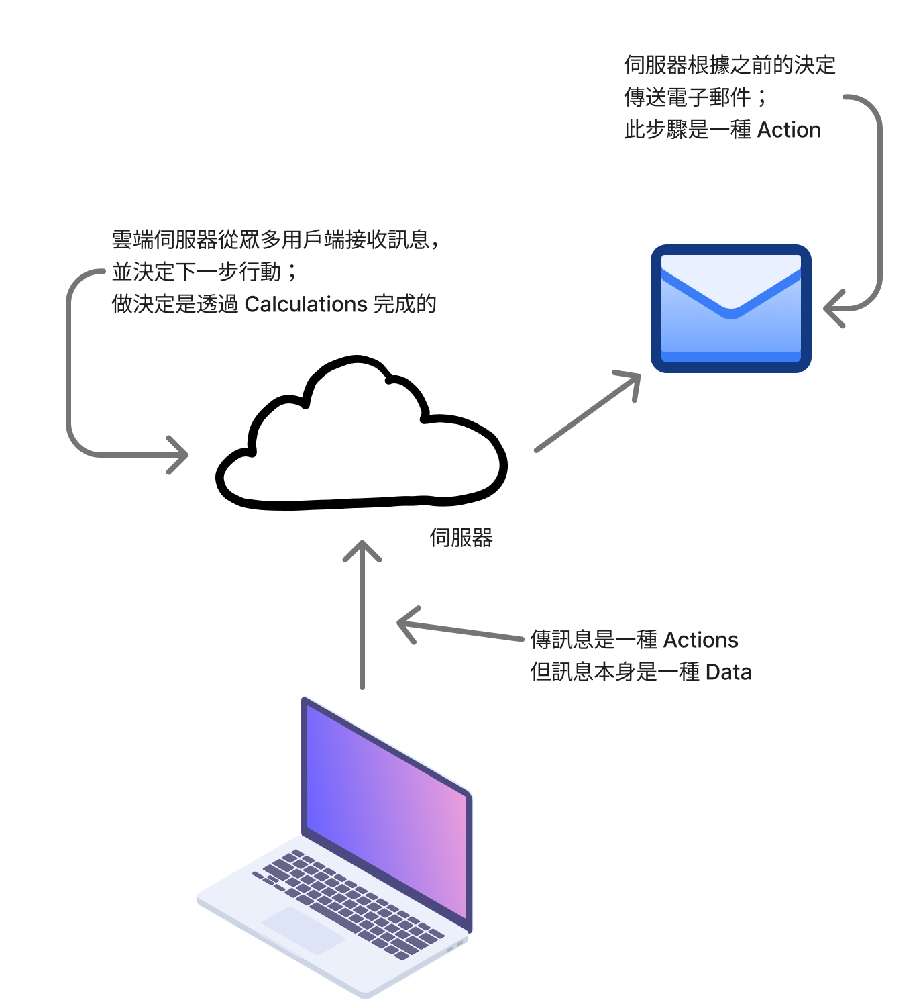
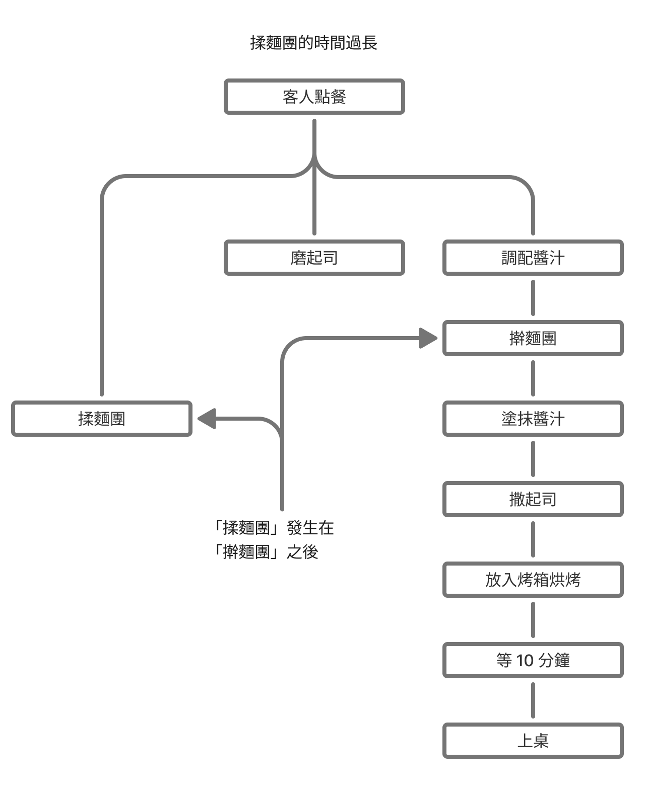
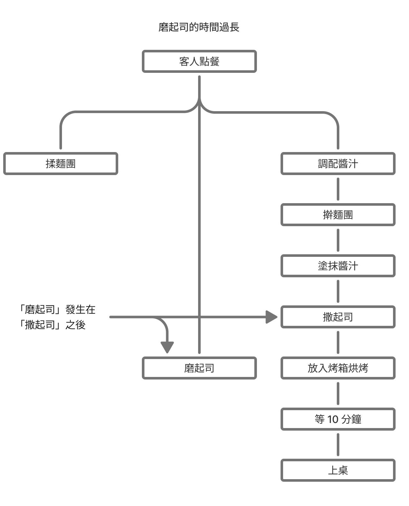
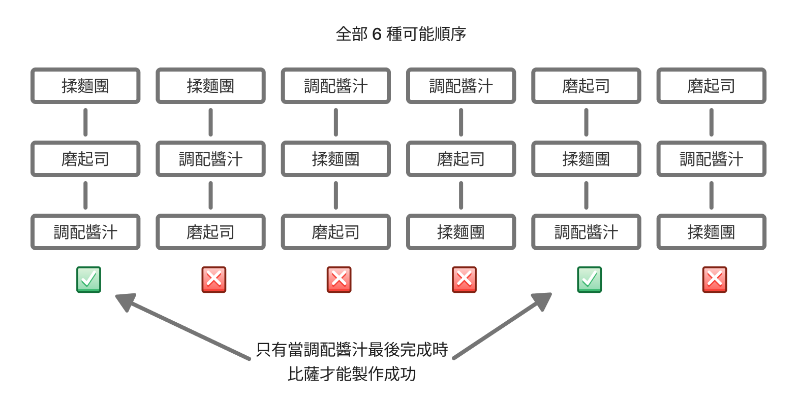
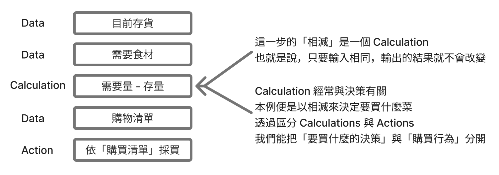
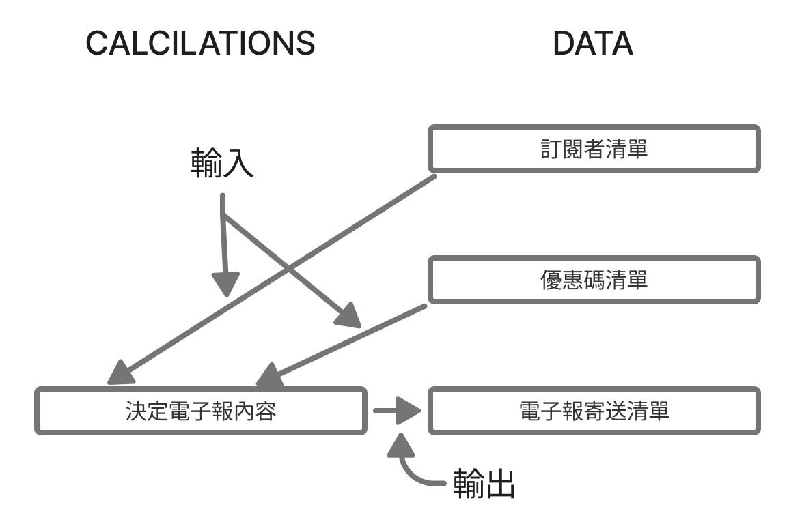
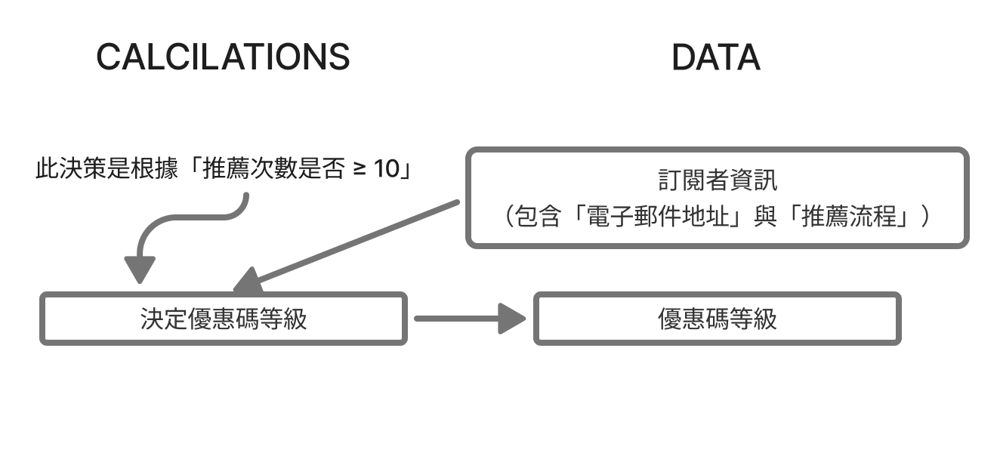
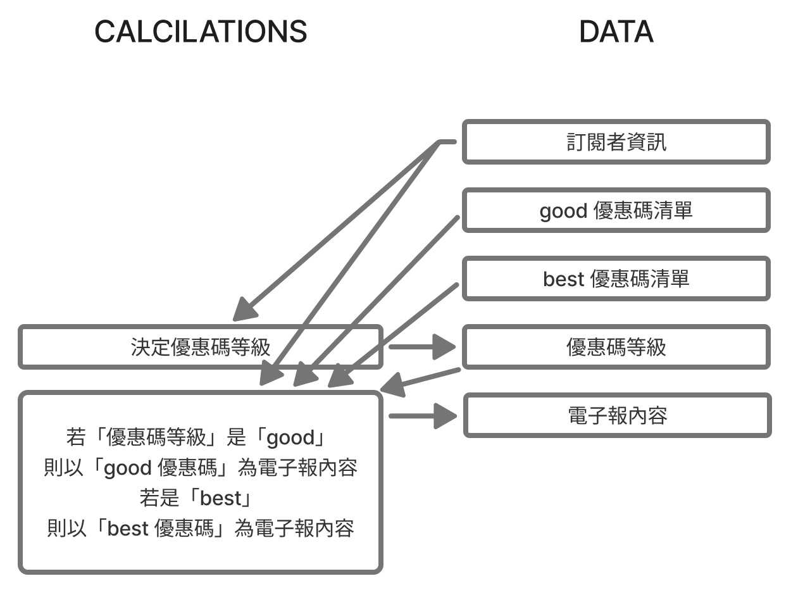
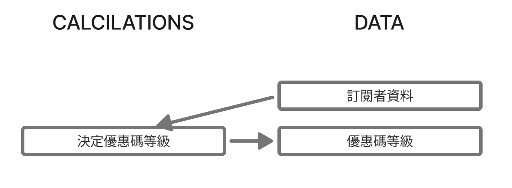

## 簡約的軟體開發思維：用 Functional Programming 重構程式 - 以 Javascript 為例

<br/>

- ## 第 1 章 初識函數式程式概念<br/>
- ## 第 2 章 實務中的函數式思維<br/>
- ## 第 3 章 分辨 Actions、Calculations 與 Data</br/>

---

## 什麼是函數式程式設計

<v-clicks depth="3">

- 函數式程式設計
  - 以使用數學函式與避免 side effects（額外作用）為特色的程式設計範式
  - 只使用無 side effects 之純函數（pure functions）的程式設計方法
- Side effects
  - 除了傳回值以外的其他函數行為（即額外作用）
  - 例如：
    - 寄送電子郵件
    - 修改全域變數
    - 讀取檔案
    - 讀指示燈閃爍
    - 發送網頁請求
    - 煞停汽車

</v-clicks>

---

### 純函數與迷思

<v-clicks depth="3">

- 純函數
  - 輸出完全由引數（arguments）決定且完全沒有 side effects 的函數
  - 當傳入的引數相同時，純函數永遠會傳回相同的值
  - 經常將此類函數稱為數學函式，藉以和程式語言中的函式做區分
- 迷思：
  - ❌ 為徹底避免 side effects 發生，FP 程式設計師只能使用純函數
  - ⭕️ 真正的 FP 程式設計師也會運用 side effects 和非純函數

</v-clicks>

---

## FP 經典定義在實務中的問題

<br/>

<v-clicks depth="3">

### 問題 1 ：FP 仍需要 side effects
- 定義宣稱 FP 會避免 side effects，但 side effects 其實是我們使用軟體的根本原因
- 發送 e-mail 是 side effects 的行為，但無法寄送 e-mail 的電子郵件軟體並沒有意義

</v-clicks>

<br/>

<v-clicks depth="3">

### 問題 2：Side effects 在 FP 中不是問題
- Side effects 雖然必要，但問題多，然而早已準備了許多工具能使非純函數更容易使用
- FP 程式設計師只使用純函數並不正確，實際上我們經常撰寫一大堆非純函數

</v-clicks>

<br/>

<v-clicks depth="3">

### 問題 3：FP 絕不僅是理論
- 經典定義將 FP 描述成了高度數學化且與實務軟體設計無關的純理論，但事實是，很多重要的軟體其實都是利用 FP 設計的

</v-clicks>

---

## 本書將函數式程式設計視為一套特定的技術與概念

<br/>

<v-clicks depth="3">

- FP 的經典定義會造成誤解，所以本書不會採用經典定義
  - 不懂 FP 的經理人上維基百科搜尋「函數式程式設計」，定義是：避免 side effects
  - 接著搜尋 side effects ：常見的 side effects 包括寄送電子郵件
  - 綜合以上的查詢結果可能造成誤解的結果是會拒絕使用 FP 來實作寄送電子郵件的服務
- 本書並未收錄任何 FP 的最新學術研究成果，或者尚待釐清的議題，只介紹即刻可以應用的技巧與知識
- 其實 FP 的核心想法可以與物件導向或程序式程式設計結合，並套用到所有程式語言中，這樣的普適性可說是 FP 最大的優勢

</v-clicks>

---

## 區分 Actions、Calculations 與 Data

<br/>

<v-clicks depth="3">

- Actions（動作、操作或行為）
  - 執行結果取決於呼叫的時間或次數
- Calcuations（計算、運算）
  - 執行結果不會隨著呼叫的時間或次數而改變
  - 如果輸入相同，輸出也必定相同
- Data（資料、數據）
  - 資料可紀錄與個事件有關的事實

</v-clicks>

---

### Actions
動作函式的執行結果受呼叫影響

<v-clicks>

```js
{"firstname":"Eric", "lastname": "Normand"}
sendEmail(to, from, subject, body) // Actions
sum(numbers)
saveUserDB(user) // Actions
string_length(str)
getCurrentTime() // Actions
[1, 10, 2, 45, 3, 98]
```

</v-clicks>

<v-clicks depth="3">

- `sendEmail(to, from, subject, body)`
  - 寄送電子郵件
- `saveUserDB(user)`
  - 將資料儲存到資料庫後，系統的其他部份就能看到該資料
- `getCurrentTime()`
  - 每次呼叫，傳回的時間都不一樣

</v-clicks>

---

### Calculations
計算可以透過運算將輸入變成輸出

<v-clicks>

```js
{"firstname":"Eric", "lastname": "Normand"}
sendEmail(to, from, subject, body) // Actions
sum(numbers) // Calculations
saveUserDB(user) // Actions
string_length(str) // Calculations
getCurrentTime() // Actions
[1, 10, 2, 45, 3, 98]
```

</v-clicks>

<v-clicks depth="3">

- `sum(numbers)`
  - 該函式可以快速求出一串數字的總和
- `string_length(str)`
  - 對該函式輸入相同的字串不論多少次，每次傳回的字串長度值永遠相同

</v-clicks>

---

### Data
資料可記錄與各事件有關的事實

<v-clicks>

```js
{"firstname":"Eric", "lastname": "Normand"} // Data
sendEmail(to, from, subject, body) // Actions
sum(numbers) // Calculations
saveUserDB(user) // Actions
string_length(str) // Calculations
getCurrentTime() // Actions
[1, 10, 2, 45, 3, 98] // Data
```

</v-clicks>

<v-clicks depth="3">

- `[1, 10, 2, 45, 3, 98]`
  - 單純的數字串列（list）
- `{"firstname":"Eric", "lastname": "Normand"}`
  - 關於某個人的資訊

</v-clicks>


---

## 函數式程式設計師眼中的 Actions、Calculations 與 Data

<br/>

<v-clicks>

假設有一個專案管理雲端服務：當用戶端將某項任務標記為「已完成」，雲端伺服器就會傳送一封通知電子郵件

</v-clicks>

<v-clicks depth="3">

- 第一步：用戶端將某項任務標記為「已完成」
  - 操作介面標記會引發一個 UI 事件
  - 該事件會受操作次數影響，屬 Actions

</v-clicks>

<v-clicks depth="3">

- 第二步：用戶端傳送訊息給伺服器
  - 傳送訊息：Actions
  - 被傳送的訊息本身：Data（需透過伺服器解讀的被動位元組資訊）

</v-clicks>

<v-clicks depth="3">

- 第三步：伺服器收到訊息
  - 接收訊息
  - 該事件會受操作次數影響，屬 Actions

</v-clicks>

---

<v-clicks depth="3">

- 第四步：伺服器修改內部資料庫
  - 改變內部狀態屬 Actions
- 第五步：伺服器決定誰需要被通知
  - 做決定屬 Calculations
  - 只要輸入資訊不變，伺服器給出的決策每次都相同
- 第六步：伺服器傳送通知電子郵件
  - 由於傳一次和傳兩次電子郵件代表不同結果，故屬 Actions

{width=250}

</v-clicks>

<!--
第五步跟第六步特別將 Calculations 與 Actions 分開
-->

---

## FP 中三類程式碼的特色整理

<br/>

<v-clicks>

### Actions

</v-clicks>

<v-clicks depth="3">

- 任何會受執行時間、執行次數、或以上兩者影響的程式碼都是 Actions
- 對應的工具：
  - 讓狀態隨時間安全改變的工具
  - 保證執行順序的方法
  - 確保動作只執行一次的工具

</v-clicks>

---

<v-clicks>

### Calculations

</v-clicks>

<v-clicks depth="3">

- 程式碼會利用輸入推導出輸出
- 輸入相同，所得輸出也必定相同
- 無論何時何地進行呼叫，此類程式碼都不受影響
- 容易測試、使用上又安全，完全不用考慮程式呼叫的時間或次數

- 對應的工具：
  - 利用靜態分析確保正確性
  - 適用於軟體中的數學工具
  - 測試結果的策略

</v-clicks>

---

<v-clicks>

### Data

</v-clicks>

<v-clicks depth="3">

- 與各事件有關的事實紀錄
- 其複雜性比可執行程式低、又具有明確的性質
- 即便不執行，此類程式碼也有重要意義，且解讀資料的方式不只一種
- 對應的工具：
  - 組織資料以利高效存取
  - 養成保留長期紀錄的習慣
  - 利用資料找出重要訊息的原則

</v-clicks>

---

## 區分 Actions、Calculations 與 Data 的好處為何？

<br/>

<v-clicks depth="3">

- 今日大多數軟體開發接考慮採分散式系統，而這正是 FP 最擅長之處
- FP 並不是新風潮，反之是一種老牌的程式設計範式（paradigms），且其用到的數學基礎更是早就有的
- 流行的原因：隨著網際網路及各式電子設備普及，程式開發者需考慮分散式系統，讓多個程式透過網路互相交流訊息
- 當程式對執行時間與次數的依賴程度越低，重大錯誤就越容易避免
  - Data 與 Calculations 程式碼不會受到執行時機或存取次數影響，因此若能讓程式中這兩類佔比提高，軟體較不會受到上述分散式系統的問題所困
  - Actions 需考慮其 side-effects 的問題，FP 有一整套確保 Actions 安全性的工具，能妥善應付分散式系統的不確定性

</v-clicks>

<v-clicks>

分散式系統的三項特徵：

</v-clicks>

<v-clicks depth="3">

- 訊息不按順序抵達
- 同樣的訊息有可能被傳送 0 次、1 次、或更多次
- 在未收到回音的情況下，無法知道系統發生了什麼事

</v-clicks>

---

## 第一章總結

<v-clicks depth="3">

- 本書第一、二篇分別對應兩大概念與其相關技術：
  - 第一篇（第三章 ~ 第九章）：區分 Actions、Calculations 與 Data
  - 第二篇（第十章 ~ 第十九章）：頭等抽象化
- FP 的標準定義適用於學術界，但至今仍未有適合軟體工程的定義出現，因此很多人對 FP 的印象是其既抽象又不切實際
- 函數式思維是與 FP 有關的各項概念與技術，也是本書的主題
- FP 程式設計師將程式碼區分為三類：Actions、Calculations 與 Data
- Actions 程式碼會受時間因素影響，最不易控制，因此需要將它們挑出來，以便投入更多注意力
- Calculations 程式碼則與時間因素無關，由於它們較好控制，因此會希望絕大多數程式屬於此類別
- Data 是被動且需要被解讀的元素，能輕易理解、儲存和轉移資料

</v-clicks>

---

## 第一章問題回顧

<v-clicks depth="3">

1. 什麼是 Actions
2. 什麼是 Calculations
3. 什麼是 Data

</v-clicks>

---

## 歡迎光臨唐妮的比薩店

<v-clicks>

想像一下在未來，比薩都是由機器人製作，且機器人程式碼都是以 JavaScript 編寫

</v-clicks>

<v-clicks>

唐妮在比薩店運作程式中運用了大量函數式思維，她答應我們參觀餐廳內的各種系統（包含廚房與庫存等），學習如何應用 FP 中的兩大技術

</v-clicks>

<v-clicks>

兩大技術：

</v-clicks>

<v-clicks depth="3">

- 區分 Actions、Calculations 與 Data
  - Actions：會使用實際原料和資源的程式碼
  - Calculations：不會使用實際原料和資源的程式碼
  - 如何使用分層設計（stratified design）將程式整理成多個層（layers）
- 使用頭等抽象化
  - 比薩店的廚房由多個機器人共同掌廚，因此是個分散系統
  - 如何以時間線圖（timeline diagram）掌握整個系統的運作
  - 如何用頭等函式（first-class functions，即：以其他函式為引數的函式）協調多個機器人，以擴大烘烤的規模

</v-clicks>

---

## 區分 Actions、Calculations 與 Data

<br/>

<v-clicks>

### Actions（動作）

</v-clicks>

<v-clicks depth="3">

- 所有受執行時間和次數影響的程式碼
- 動作例子：
  - 擀麵團
  - 送比薩
  - 進原料

</v-clicks>

<v-clicks>

### Calculations（計算）

</v-clicks>

<v-clicks depth="3">

- 計算與決策和計劃有關，但不會直接與環境互動
- 可以隨時隨地呼叫它們
- 計算例子：
  - 調整食譜
  - 列採購清單

</v-clicks>

---

### Data（資料）

<v-clicks depth="3">

- Data 可以被儲存在網路上並做各種應用，具有很高的彈性
- 資料的例子：
  - 財務數據
  - 庫存清單
  - 比薩的食譜
  - 客人的點餐資訊
  - 收據
  - 食譜

</v-clicks>


---
layout: image-right
image: ./images/1.png
class: my-cool-content-on-the-left
backgroundSize: contain
---

## 初探分層設計，依「變化頻率」整理程式碼

</br>

<v-clicks depth="3">

- 將程式碼做分層整理，最上層為經常變動，最下層為幾乎不隨時間變化
- 每一層元素都建立在下層之上，由於下層元素較不隨時間改變，因此賦予了上層元素穩定的基礎
- 上層就算經常變動，例如換菜單，也沒有關係，因為主要程式碼在下層
- 下層雖有可能變化但頻率非常低
- 這種架構會產生多個層（layers），因此將之稱為分層設計（stratified design）
- 本例子中，主要分層有三個，分別對應：營業規則、領域規則、以及技術棧

</v-clicks>

---
layout: image-right

# the image source
image: ./images/2.png

# a custom class name to the content
class: my-cool-content-on-the-left

backgroundSize: auto 90%
---

## 使用頭等抽象化

<v-clicks depth="3">

- 將一台機器人製作比薩的過程畫成時間線圖（timeline diagram）
- 一台機器人對應一個時間線
- 由於 Action 程式碼會受執行時間影響，所以這個順序絕對不能亂

</v-clicks>

---
layout: image-right

# the image source
image: ./images/3.png

# a custom class name to the content
class: my-cool-content-on-the-left

backgroundSize: auto 90%
---

## 以時間線圖將分散式系統視覺化

- 多台機器人一起工作形成了分散式系統，可能導致 Actions 程式碼的順序亂掉

---

## 多條時間線的執行順序可能不同

<div>
  <div>
   <ul>
   <v-clicks>
   <li>因為並未協調三條時間線，因此時間線之間並不會互相等待，也因如此，不同時間線上的 Actions 有一定機率不按順序執行</li>
   </v-clicks>
      <v-clicks>
      <li>舉例：</li>
      </v-clicks>
      <div class="grid grid-cols-2 gap-5 items-center">
      <div class="grid grid-cols-2 gap-5 items-center">
      <v-clicks>
      <li>揉麵團」有可能發生在「調配醬汁」之後，導致醬汁機器人會在麵團尚未揉好之前先「擀麵團」</li>
      </v-clicks>
      <v-clicks>
      
      </v-clicks>
      </div>
      <div class="grid grid-cols-2 gap-5 items-center">
       <v-clicks>
       <li>「磨起司」最後才完成，導致醬汁機器人會在沒有起司的情況下「撒起司」</li>
       </v-clicks>
       <v-clicks>
       
       </v-clicks>
      </div>
      </div>
   </ul>
  </div>
</div>

---

<v-clicks>

- 本例的三項預備工作（揉麵團、磨起司、調配醬汁）可能出現六種不同的執行順序

</v-clicks>
<v-clicks>

- 只有當「調配醬汁」最後完成時，比薩才能製作成功，這只發生在其中兩種可能性裡：

</v-clicks>
<v-clicks>

  {width=500}

</v-clicks>
<v-clicks>

- 處理分散式系統最困難之處在於：若不進行協調，時間線的順序可能會大亂

</v-clicks>
---

## 關於分散式系統的寶貴經驗

<br/>

<v-clicks depth="3">

- 時間線之間必須互相協調
  - 得協調不同時間線，否則就有可能發生「麵團還沒準備好，但其它程序仍繼續執行」的狀況
- Actions 的執行時長並不固定
  - 即便觀察到「調配醬汁」在某一次所花的時間最久，也不能保證下一次也是如此
  - 處理時間線時，不能假設它們有固定順序
- 即便是機率很小的順序錯誤也有可能在實務中發生
  - 即使某類順序錯誤發生機率小，當有大量訂單時，少見的失誤也有可能變得頻繁
  - 必須確保時間線的執行每一次都萬無一失
- 時間線圖能顯示出系統的問題
  - 應善用時間線圖來瞭解系統

</v-clicks>

---
layout: image-right
image: ./images/7.png
class: my-cool-content-on-the-left
backgroundSize: auto 80%
---

## 時間線分界：讓機器人互相等待

<v-clicks depth="3">

- 為了解決順序問題，使用了時間線分界（cultting）的高階操作（higher-orderoperation），以協調多條平行線
- 主要概念：每條時間線各自獨立運作，但先完成的時間線需暫停等待後完成者

</v-clicks>


---

## 我們從時間線中學到的事：協調多台機器人

<br/>

<v-clicks depth="3">

- 將大程序拆分成小程序能讓軟體設計更加容易
  - 藉由中斷，將可平行執行的原料預備工作和序列化的比薩製作流程分開
  - 同時還讓預備工作的時間線順序不再重要
- 時間線圖能告訴我們系統行為如何隨時間變化
  - 時間線圖能有效將平行且分散式的系統視覺化
- 時間線圖具備彈性
  - 時間線圖能展示出時間線之間的協調關係

</v-clicks>

---

## 第二章總結
<br/>

<v-clicks depth="3">

- 比薩店的唐妮利用分層設計整理 Actions 與 Calculations 程式碼，以降低程式維護的困難度（對應第三 ~ 九章）
- 接著使用時間線圖與分界技巧擴增廚房機器人的數量，同時避免 Actions 的執行順序錯誤（第十五 ~ 第十七章）
- 區分 Actions、Calculations 與 Data 是 FP 程式設計師最基礎也最重要的技能，將在第三章開始說明如何分辨
- FP 程式設計師會利用分層設計降低軟體維護的困難度，在此設計架構中，會依程式碼的變化頻率將其分層，將在第八、九章詳細說明
- 時間線圖能將 Actions 程式碼的執行順序視覺化，並指出 Actions 之間相互干擾的地方，將在第十五章學習如何繪製時間線圖
- 本章介紹了如何利用分界來協調不同 Actions ，以避免程式執行結果受時間線的完成順序影響，將在第十七章說明如何分界時間線

</v-clicks>

---

## 第二章問題回顧

<br/>

<v-clicks>

1. 請問以下哪一項屬於「Actions（動作）」的範疇？為什麼？
  - A. 調整食譜
  - B. 擀麵團
  - C. 財務數據
  - D. 計算採購清單

</v-clicks>

<v-clicks>

2. 在分散式系統中，如果沒有對多條時間線進行協調，會導致什麼問題？為什麼？
  - A. 系統無法存取資料
  - B. 程式無法重構
  - C. 各個步驟的執行順序可能錯亂
  - D. 函數無法被重複使用

</v-clicks>

---

3. 「分層設計（Stratified Design）」的核心理念是什麼？為什麼？
  - A. 把所有邏輯集中寫在一層，方便管理
  - B. 將動作與資料混合處理，提高效能
  - C. 根據變化頻率，把程式碼拆成多層，讓上層依賴下層穩定性
  - D. 依照程式語言語法自動分類程式碼

---

## ACD 的特性與應用時機

| **Actions**                                          | **Calculations**                                 | **Data**                                                      |
| ------------------------------------------------ | -------------------------------------------- | --------------------------------------------------------- |
| **會產生 side effects，且受執行時間或次數影響**  | **透過運算將輸入轉為輸出**                   | **關於各事件的事實紀錄**                                  |
| 也稱為額外作用函數、非純函數（impure functions） | 也稱為純函數、數學函數                       |                                                           |
| **例子：**                                       | **例子：**                                   | **例子：**                                                |
| <ul><li>傳送電子郵件</li><li>從資料庫讀取資料</li></ul> | <ul><li>找出最大值</li><li>確認 e-mail 格式是否正確</li></ul> | <ul><li>使用者輸入的 e-mail 地址</li><li>從銀行 API 讀取到的金額</li></ul> |

---

具體應用時機：

<v-clicks depth="3">

- 思考問題
   - 分類能幫助我們弄清程式中有哪些部分
      - 需要特別當心：Actions
      - 需要保存：Data
      - 需要做決策：Calculations
- 撰寫程式碼
   - 三者能夠區分得越明確越好
   - 是否能將 Actions 改寫成 Calculations
   - 或者將 Calculations 改用 Data 呈現
- 閱讀程式碼
   - 由於 Actions 會受時間影響，可能使得執行結果出乎意料，所以會特別注意

</v-clicks>

---
layout: image-right
image: ./images/25.png
class: my-cool-content-on-the-left
backgroundSize: contain
---

## 生活中的 ACD

<v-clicks>

以買菜做為例子

</v-clicks>
<v-clicks depth="3">

- 以上面流程為大綱，仔細挖掘隱藏在每個 Actions 步驟中的 Calculations 與 Data
   - 步驟一：檢查冰箱
      - 由於查看冰箱的時間點會影響結果，所以此為 Action
      - 而冰箱裡有哪些食物則是 Data，我們將其稱為「目前存貨」

</v-clicks>

---
layout: image-right
image: ./images/26.png
class: my-cool-content-on-the-left
backgroundSize: contain
---

<v-clicks depth="3">

- 步驟二：開車到賣場
  - 開車到賣場是個複雜的行為，所以此為 Action
  - 仍需要一些 Data，如：
    - 賣場的地理位置
    - 行車路線
  - 但由於本例主要目標並不是設計自動駕駛汽車，故不深入討論

</v-clicks>

---
layout: image-right
image: ./images/8.png
class: my-cool-content-on-the-left
backgroundSize: contain
---

<v-clicks depth="3">

- 步驟三：購買需要的菜
  - 買東西是 Action，而且還能進一步拆解
  - 首先得利用 Calculations 把需要但冰箱沒有的菜列成「購物清單」
  - 需要利用步驟一中的「目前存貨」Data
    - 算式：購物清單 = 需要食材 - 目前存貨
  - 步驟三實際上可拆解成以下幾個項目：
</v-clicks>
<v-clicks>

  {width=400}

</v-clicks>
<v-clicks depth="3">

- 步驟四：開車回家
  - 步驟四也能被進一步拆解，但與步驟二一樣，並非本例重點所以跳過

</v-clicks>
---
layout: image-right
image: ./images/10.png
class: my-cool-content-on-the-left
backgroundSize: contain
---

## 現在把缺失的元素加回原本的流程
<v-clicks depth="3">

  - 只要挖得越深，得到的模型就越精細，舉例：
    - 可以把「檢查冰箱」進一步拆解為「檢查冷藏櫃」和「檢查冷凍櫃」，讓兩者分別產生各自的 Data 再將其合併
    - 「採買購物清單上的食材」顯然包含「放入購物車」與「結帳」等 Actions
  - 可以自行決定模型的複雜程度
  - **此處重點**：FP 程式設計師必須意識到一個 Action 可能是由眾多 Calculations、Data 以及其他 Actions 交織而成，所以務必盡量嘗試去拆解

</v-clicks>

---

## 買菜教會我們的事情

<br/>

<v-clicks depth="3">

- ACD 觀點可套用到各種情境中
- 每個 Action 中可能藏有 Calculations、Data 與其它 Actions
   - 一個簡單的 Action 可能是由其他幾類程式碼共同組成
   - FP 關鍵之一：瞭解如何將 Actions 拆解成 Calculation、Data 與其它小 Actions
   - 拆解也需要適可而止
- Calculations 可能由其他小 Calculations 與 Data 組成
   - Calculations 中確實可能隱藏著 Data，這些 Data 通常不會造成問題，但有時將 Calculations 進一步分解能獲得額外好處
   - 此類分解最常見的形式是將一個 Calculation 分成兩個小 Calculations，並將前一個 Calculation 的輸出作為最後一個的輸入

</v-clicks>

---

<v-clicks depth="3">

- Data 中就只有 Data
   - Data 就是固定資料，其中不會有 Calculations 或 Actions
- 流程中的 Calculations 很容易被忽視
   - 一般來說，決策與計劃所在的地方就可能有 Calculations，可問自己：
      - 流程中有哪些地方需要做決策？
      - 哪些地方得事先計劃？

</v-clicks>

---

## 深入探索：Data（資料）

<br/>

<v-clicks>

### 什麼是資料？

</v-clicks>
<v-clicks>

- 資料就是關於事件的事實紀錄

</v-clicks>
<v-clicks>

### 如何實作資料？

</v-clicks>
<v-clicks>

- 在 JavaScript 中，資料是透過內建資料型別（data types）來實作

</v-clicks>
<v-clicks>

### 資料的意義透過什麼表達？

</v-clicks>
<v-clicks depth="3">

- 資料的意義需編碼在結構中，換言之，資料的結構應該要能反映領域（domain）中的資訊
- 假如某個清單中的順序項目很重要，那麼你選擇的資料結構就必須要能保留順序才行

</v-clicks>

<v-clicks>

### 不變性

</v-clicks>
<v-clicks depth="3">

- 利用兩種方法來保證資料的不變性：
   - 寫入時複製（copy-on-write）：在更動資料以前先進行複製
   - 防禦型複製（defensive copying）：複製需要保留的資料

</v-clicks>

---

<v-clicks>

### 資料的優點為何？

</v-clicks>
<v-clicks depth="3">

- 可傳遞性與可儲存性
   - 把 Actions 和 Calculations 移到另一台機器上執行時很可能會出問題
   - 但資料只要透過傳遞、儲存就能供日後讀取
   - 妥善儲存的資料可以存放很長的時間
- 可比較異同
   - 比較兩筆資料相同與否是很簡單的事
- 可解釋性
   - 一筆資料的解釋方式不只一種
   - 以伺服器登錄紀錄來說，我們可以
      - 用來除錯
      - 研究網站流量的來源

</v-clicks>
---

### 資料的缺點
- 可解釋性是一把雙面刃，「資料需要被解釋才有作用」是一項缺點
- 與資料相比，即便不了解某段 Calculations 程式碼的內容，還是可以執行之並使其發揮功能
- 但資料卻一定得經過詮釋才能獲得意義，否則就只是一堆位元碼

<br/>

### 資料的例子
- 食材採購清單
- 你的名字
- 某人的電話號碼
- 一道菜的食譜

<br/>

> 函數式程式設計很大一部分技巧在於如何表達資料，使其能夠在當下被解讀，同時也能在未來重新詮釋


---
layout: image-right
image: ./images/11.png
class: my-cool-content-on-the-left
backgroundSize: contain
---

## 用函數式思維撰寫程式

<v-clicks>

CouponDog 是個優惠碼資訊站，對此類訊息感興趣的人可以留下自己的 e-mail ，該平台會每週發送優惠碼電子報給訂閱者

</v-clicks>
<v-clicks>

為了搜集更多訂閱者的電子郵件，該平台的行銷長制定了以下新方案：只要向 10 位好友推薦 CouponDog，推薦人與朋友就都能獲得折扣更好的優惠碼

</v-clicks>


---
layout: image-right
image: ./images/12.png
class: my-cool-content-on-the-left
backgroundSize: contain
---

## 畫出優惠碼電子報的流程圖

<br/>

<v-clicks depth="3">

1. 讀取資料庫中的訂閱者資訊
   - 由於今天取得的訂閱者名單可能與明日取得的不同（即：結果取決於執行時間），故此步屬於 Action
   - 讀取完後，會得到一個「訂閱者清單」，這是 Data

</v-clicks>

---
layout: image-right
image: ./images/13.png
class: my-cool-content-on-the-left
backgroundSize: contain
---

<br/>

2. 讀取資料庫中的優惠碼
<v-clicks depth="3">

   - 因為資料庫中的優惠碼隨時在更新，所以讀取的時機將影響輸出結果，故此步屬於 Action
   - 讀取完後，會取得存取當下的「資料庫中所有優惠碼的紀錄」，這是 Data

</v-clicks>

---
layout: image-right
image: ./images/14.png
class: my-cool-content-on-the-left
backgroundSize: contain
---


3. 產生電子報寄送清單
<v-clicks depth="3">

   - FP 程式設計師會將「產生 Data」的過程與「實際使用該 Data」分開
   - 買菜的例子：我們不會邊逛街邊想要買什麼，而是先把購物清單擬好再開始採買
   - 「決定電子報內容（Calculations）」的輸出結果為下一步所需的 Data，即：「電子報寄送清單」，該清單紀錄每位訂閱者將收到的電子報內容（即：不同等級的優惠碼）

</v-clicks>

---
layout: image-right
image: ./images/15.png
class: my-cool-content-on-the-left
backgroundSize: contain
---

4. 寄送電子報
<v-clicks depth="3">

   - 有了「電子報寄送清單」之後，就能實際執行該計劃
   - 只要走訪「電子報寄送清單」內的每一個電子郵件地址，並將對應的優惠碼寄出即可
   - 在到達此步驟以前，所有決策皆已完成

</v-clicks>

---
layout: image-right
image: ./images/16.png
class: my-cool-content-on-the-left
backgroundSize: contain
---

### 電子報寄送清單的產生過程

<v-clicks depth="3">

- 大多數人都是在準備送出電子郵件時才開始想應該怎麼寄
- 對 FP 來說，先計劃、再行動（也就是把決策和動作分開）是很常見的思維
- 接下來深入探討「決定電子報內容」的計算方法，並進而拆解出更小的計算
- 由圖的箭頭方向可看到圖中 Calculation 需要兩項 Data
   - 「訂閱者紀錄清單」
   - 「優惠碼清單」
- 不直接把這步驟寫成 Action，是因為 Calculation 不會實際把信寄出去，可以測試到不會出錯為止

</v-clicks>

---
layout: image-right
image: ./images/18.png
class: my-cool-content-on-the-left
backgroundSize: contain
---

### 「決定電子報內容」如何拆解出小 Calculations

{width=300}
- 先加入兩個新的 Calculations ，將原本的「優惠碼清單」分割成「good 優惠碼清單」與「best 優惠碼清單」兩部分

---

<v-clicks>

- 接著再以另一個 Calculation 判斷訂閱者應該收到 good 或 best 優惠碼
   {width=250}

</v-clicks>
<v-clicks>

- 現在只要將上面的內容合在一起，就能知道如何根據「特定訂閱者的資訊」計算出電子報內容（也就是優惠碼等級）
   {width=250}

</v-clicks>
<v-clicks>

- 得到完整的「電子報寄送清單」（該清單包含每一位訂閱者應該收到的電子報內容），只需逐一將不同訂閱者的資料輸入上述流程，再將「電子報內容」匯集起來並傳回即可

</v-clicks>

---
layout: image-right
image: ./images/22.png
class: my-cool-content-on-the-left
backgroundSize: auto 70%
---

## 實作優惠券電子報流程
### 透過訂閱者資料來決定優惠碼等級
{width=300}
#### 「訂閱者資料」來自資料庫（Data）

```javascript
// 將圖中表格的每一列都變成像這樣的物件
var subscriber = {
  email: "sam@pmail.com",
  rec_count: 16
};
```

---
layout: image-right
image: ./images/23.png
class: my-cool-content-on-the-left
backgroundSize: auto 70%
---

#### 「優惠碼等級」是字串資料（Data）

```javascript
// 「優惠碼等級」是字串資料
var rank1 = "best";
var rank2 = "good";
```

---

#### 「決定優惠碼等級」是函式（Calculation）

<v-clicks depth="3">

- 優惠碼等級是從資料經過計算而得
   - 寫成 `subCouponRank()`，其輸入的參數是 `subscriber` 訂閱者物件
   - 輸出的傳回值（即優惠碼等級）依每位訂閱者的 `rec_count` 屬性值是否大於等於 10 而定

</v-clicks>
<v-clicks>

   ```javascript
   function subCouponRank(subscriber){
     if(subscriber.rec_count >= 10)
       return "best";
     else
       return "good";
   }
   ```

</v-clicks>
<v-clicks depth="3">

- 至此，我們已將「決定每位訂閱者應收到何種優惠碼等級」包裝成精簡、容易測試且可重複使用的 `subCouponRank` 函式
- Calculation 可將輸入經過運算後轉換為輸出結果，其不受呼叫時機和次數影響，只要輸入的參數相同，其輸出也會相同

</v-clicks>

---
layout: image-right
image: ./images/23.png
class: my-cool-content-on-the-left
backgroundSize: auto 70%
---

### 從「優惠碼清單」中選出給定等級的優惠碼
{width=300}
#### 「優惠碼清單」來自於資料庫（Data）
```javascript
// 將圖中表格的每一列都變成像這樣的物件
var coupon = {
  code: "10PERCENT",
  rank: "bad"
};
```

---

#### 「選取等級優惠碼」是函式（Calculation）

<v-clicks depth="3">

- 接下來要將優惠碼清單中的不同等級區分開來，這是一個 Calculation
- 這裡函式的輸入有兩個：
   - coupons：內含不同等級優惠碼的清單
   - rank：指定的等級
- 輸出則是指定等級的優惠碼清單，例如輸入的等級是 good，輸出的就是「good 優惠碼清單」

</v-clicks>

<v-clicks>

```javascript
function selectCouponsByRank(coupons, rank) {
  var ret = []; // 初始化一個空陣列
  for(var c = 0; c < coupons.length; c++) { // 走訪每一筆優惠碼
    var coupon = coupons[c];
    if(coupon.rank === rank)
      ret.push(coupon.code); // 將符合優惠碼等級的優惠碼加入 ret 陣列中
  }
  return ret; // 將陣列傳回
}
```

</v-clicks>

---

```javascript
function selectCouponsByRank(coupons, rank) {
  var ret = []; // 初始化一個空陣列
  for(var c = 0; c < coupons.length; c++) { // 走訪每一筆優惠碼
    var coupon = coupons[c];
    if(coupon.rank === rank)
      ret.push(coupon.code); // 將符合優惠碼等級的優惠碼加入 ret 陣列中
  }
  return ret; // 將陣列傳回
}
```

<v-clicks depth="3">

- 為了確認 `selectCouponsByRank()` 是一個 Calculation，思考以下幾個問題：
   - 當傳入的參數相同時，該函式有可能給出不同的傳回值嗎？
      - 否，因為同樣的 coupons 與 rank 必然產生相同輸出
   - 函式的執行結果會隨著執行時機或次數而變嗎？
      - 否，無論執行幾次或何時執行，得到的傳回值都不受影響
   - 因此，這肯定是一個 Calculation

</v-clicks>

---
layout: image-right
image: ./images/27.png
class: my-cool-content-on-the-left
backgroundSize: contain
---

### 決定每位訂閱者的電子報內容（告知其取得的優惠等級）
#### 「電子報內容」是選取後的優惠碼等級（Data）

```javascript
var message = { // 此物件已包含了所有寄信所需的資訊，不必做任何決策
  from: "newsletter@coupondog.co",
  to: "sam@pmail.com",
  subject: "Your weekly coupons inside",
  body: "Here are your coupons ..."
}
```

---

#### 為單一訂閱者產生電子報內容（Calculation）

<br/>

<v-clicks depth="3">

- 現在要寫一個函式，其輸入參數包括：
   - 某訂閱者的電子郵件
   - 要傳送給他的優惠碼
- 由於尚未判斷該訂閱者的等級，所以將「good 優惠碼清單」與「best 優惠碼清單」一起當作參數輸入，並將訂閱者資訊傳入前面寫好的 `subCouponRank` 以得到他的等級，再依等級是 good 或 best 產生他的電子報內容

</v-clicks>

<v-clicks>

```js {*}{maxHeight:'200px'}
function emailForSubscriber(subscriber, goods, bests) {
    var rank = subCouponRank(subscriber);  
  
    if (rank === "best") // 決定優惠碼等級
        return { // 產生並回傳 best 優惠碼電子報內容
            from: "newsletter@coupondog.co",
            to: subscriber.email,
            subject: "Your best weekly coupons inside",
            body: "Here are the best coupons: " + bests.join(", ")
        };
    else // rank === "good"
        return { // 產生並回傳 good 優惠碼電子報內容
            from: "newsletter@coupondog.co",
            to: subscriber.email,
            subject: "Your good weekly coupons inside",
            body: "Here are the good coupons: " + goods.join(", ")
        };
}
```

</v-clicks>

<v-clicks>

- 由於上述函式只決定並產生「電子報內容」（Data），沒有實際寄送或其他 side effect，故屬於 Calculation

</v-clicks>

---

#### 為所有訂閱者產生電子報內容（Calculation）

<v-clicks depth="3">

- 前面的 `emailForSubscriber()` 已能生成單一訂閱者的電子報
- 現在需要一個能替所有訂閱者產生電子報的函式，這只需要使用迴圈一一走訪訂閱者清單就行了

</v-clicks>

<v-clicks>

```javascript
function emailsForSubscribers(subscribers, goods, bests) {
    var emails = [];
    for (var s = 0; s < subscribers.length; s++) {
        var subscriber = subscribers[s];
        var email = emailForSubscriber(subscriber, goods, bests); // 先走訪單一訂閱者以產鞥電子報，並將結果 push 到陣列中
        emails.push(email);
    }
    return emails;
}
```

</v-clicks>

---

#### 「寄送電子報」是一個動作（Action）

<v-clicks>

```javascript
function sendIssue() { // 此函式將所需的所有元素連結起來了
    var coupons = fetchCouponsFromDB(); // 從資料庫中讀取完整的「優惠碼清單」
    var goodCoupons = selectCouponsByRank(coupons, "good");
    var bestCoupons = selectCouponsByRank(coupons, "best");
    var subscribers = fetchSubscribersFromDB(); // 從資料庫讀取完整的「訂閱者清單」
    var emails = emailsForSubscribers(subscribers, goodCoupons, bestCoupons);
    
    for (var e = 0; e < emails.length; e++) {
        var email = emails[e];
        emailSystem.send(email);
    }
}
```

</v-clicks>

<v-clicks depth="3">

- 將 Data 的部分寫在程式碼的最前頭，然後將 Data 送去 Calculation 以取得所需的新資料
- 最後，所有東西納入功能最多的 Action 內
- 換言之，本例的程式就是依循 FP「先資料、再計算、最後動作」的模式進行

</v-clicks>

---

### 常見的 FP 實作順序

<v-clicks depth="3">

- Data（資料）
- Calculations（計算）
- Actions（動作）

</v-clicks>

<v-clicks>

### 如果有上百萬名訂閱者怎麼辦？

</v-clicks>

<v-clicks>

```javascript {*}{maxHeight:'150px'}
function sendIssue() {
    var coupons = fetchCouponsFromDB();
    var goodCoupons = selectCouponsByRank(coupons, "good");
    var bestCoupons = selectCouponsByRank(coupons, "best");
    var page = 0; // 從訂閱者清單的第 0 頁開始讀取
    var subscribers = fetchSubscribersFromDB(page);

    while (subscribers.length > 0) { // 持續走訪，直到遇到空白頁
        var emails = emailsForSubscribers(subscribers, goodCoupons, bestCoupons);

        for (var e = 0; e < emails.length; e++) {
            var email = emails[e];
            emailSystem.send(email);
        }

        page++; // 讀取下一頁
        subscribers = fetchSubscribersFromDB(page);
    }
}
```

</v-clicks>

<v-clicks depth="3">

- 本例的 Calculations 皆保持不變，所有優化修改都發生在 Actions 之中
- `fetchSubscribersFromDB()` 是一個 Action，因為今天讀取的訂閱者清單可能和明天的不同
- 在一個設計良好的系統中，Calculations 代表與時間無關、且通常為抽象的操作，如「為一定數量的訂閱者產生電子報內容」
- 「將 Data 從資料庫寫入記憶體」則屬於 Actions，因為可以變更讀取的資料筆數

</v-clicks>

---

## 將函數式思維應用在既存的程式碼

```javascript {4}
function figurePayout(affiliate) {
    var owed = affiliate.sales * affiliate.commission;
    if (owed > 100) // don’t send payouts less than $100
        sendPayout(affiliate.bank_code, owed);
}

function affiliatePayout(affiliates) {
    for (var a = 0; a < affiliates.length; a++)
        figurePayout(affiliates[a]);
}

function main(affiliates) {
    affiliatePayout(affiliates);
}
```

- 這是之前提過的 Action
- 之所以將其列為 Action 而非 Calculation ，是因為「匯款至銀行帳戶」這個動作明顯受執行時間與次數影響

---

```javascript {1-5,9}
function figurePayout(affiliate) {
    var owed = affiliate.sales * affiliate.commission;
    if (owed > 100) // don’t send payouts less than $100
        sendPayout(affiliate.bank_code, owed);
}

function affiliatePayout(affiliates) {
    for (var a = 0; a < affiliates.length; a++)
        figurePayout(affiliates[a]);
}

function main(affiliates) {
    affiliatePayout(affiliates);
}
```

- 由於 `figurePayout()` 中呼叫了一個 Action ，所以此函式也會是 Action

---

```javascript {1-5,7-10,13}
function figurePayout(affiliate) {
    var owed = affiliate.sales * affiliate.commission;
    if (owed > 100) // don’t send payouts less than $100
        sendPayout(affiliate.bank_code, owed);
}

function affiliatePayout(affiliates) {
    for (var a = 0; a < affiliates.length; a++)
        figurePayout(affiliates[a]);
}

function main(affiliates) {
    affiliatePayout(affiliates);
}
```

- 因為 `affiliatePayout()` 呼叫了 Action ，故也成為 Action


---

```javascript {1-5,7-10,12-14}
function figurePayout(affiliate) {
    var owed = affiliate.sales * affiliate.commission;
    if (owed > 100) // don’t send payouts less than $100
        sendPayout(affiliate.bank_code, owed);
}

function affiliatePayout(affiliates) {
    for (var a = 0; a < affiliates.length; a++)
        figurePayout(affiliates[a]);
}

function main(affiliates) {
    affiliatePayout(affiliates);
}
```

- 最終，`main()` 也無可避免地變成了 Action 

---

## Actions 會在程式中擴散

<br/>


<v-clicks depth="3">

- Actions 最惡名昭彰的特質：其時間依賴性會在程式中擴散
- 當甲函式呼叫了一個 Action ，甲函式就會變成 Action
- 若乙函式又呼叫了甲函式，那麼乙函式也會變成 Action
- 程式碼中一個一個微小的 Action ，最終會擴散到所有程式碼中

</v-clicks>


---

## Actions 的形式多變

JavaScript 程式的 Actions：
<v-clicks depth="3">

- Function calls（函式呼叫）
   `alert("Hello world!");`
- Method calls
   `console.log("hello");`
- Constrictors（建構元）
   `new Date()`
- Expressions（算式）
   - variable（存取變數）
      - `y`
      - 若 y 是一個共享變數，其數值可能隨時間而異
   - property（讀取屬性）
      - `user.first_name`
      - 若 user 為共享且可變的物件，讀取其 first_name 屬性值可能每次不同
   - array（讀取陣列）
      - `stack[0]`
      - 若 stack 是一個共享且可變的陣列，其第一個元素可能隨時間變化

</v-clicks>

---

<v-clicks depth="3">

- Statements（陳述句）
   - 指定值
      - `z = 3;`
      - 將值指定給共享變數，其值可能隨時間改變而影響用到此變數的其它程式碼
   - 刪除屬性
      - `delete user.first_name;`
      - 此屬性刪除也會影響用到此屬性的程式碼
- 以上所列都屬於 Actions ，也就是依照執行時間與次數的不同，它們可能產生不一樣的結果
- 只要在程式中用到這些，其效果便會擴散
- 只要問一個簡單的問題：這段程式碼會受執行時機或次數影響嗎？

</v-clicks>

---

## 第三章總結：

<br/>

<v-clicks depth="3">

- Calculation 可以被理解為「做計劃」或「做決策」，而其產生的「計畫」或「決策」則是 Data
- 最後可以用 Actions 將計畫付諸「執行」
- FP 程式設計師會區分 Actions、Calculations 與 Data，學習這三類程式碼的區別是掌握 FP 的第一步
- Actions 的結果取決於執行時間與次數，其通常會對軟體系統的環境產生實際作用，或者被環境影響
- Calculation 是將輸入轉換為輸入的運算過程，它們不會對自身以外的東西產生作用，也因此與執行時間和次數無關
- Data 是事件的事實紀錄，由於事實不隨時間改變，故資料應具不變性
- FP 程式設計師對 ACD 的喜愛程度：D > C > A
- Calculations 比 Actions 更容易測試

</v-clicks>

---

## 第三章問題回顧：

<br/>

<v-clicks>

1. 以下哪一段 JavaScript 程式碼屬於 Calculation？
  - `A. alert("Hello world!")`
  - `B. new Date()`
  - `C. selectCouponsByRank(coupons, "good")`
  - `D. emailSystem.send(email)`

</v-clicks>

<v-clicks>

2. 在購物流程中，「檢查冰箱內容」是 Action，而「目前冰箱內的食材」是 Data。請舉出另一個日常生活中的例子，並說明其中的 Action 與 Data 是什麼

</v-clicks>

<v-clicks>

3. 書中提到：「Actions 的特質會在程式中擴散」。請說明這句話的意義，以及這種特性可能帶來的風險

</v-clicks>

<v-clicks>

4. 為什麼在函數式設計中，我們希望將「決策」與「行動」分開？
  - A. 可以減少記憶體使用
  - B. 增加程式碼長度使其更安全
  - C. 使程式更容易測試與重用
  - D. 讓函式無法被呼叫

</v-clicks>